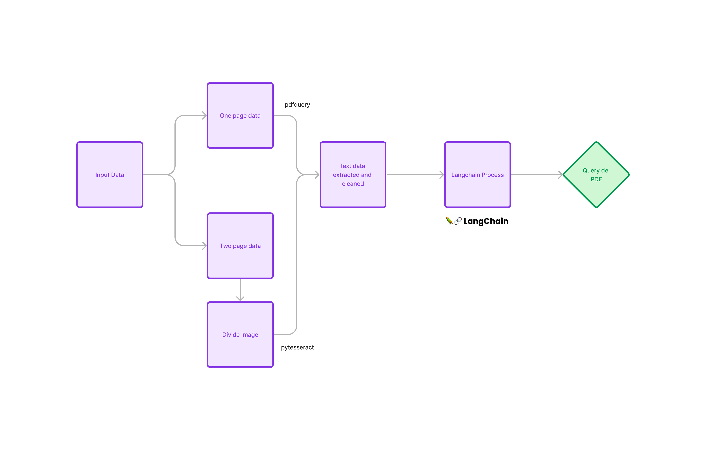

# dapta-bot

Este es un chatbot construido con langchain y streamlit para el aprendizaje de PDFs y consulta a los mismos.

## Descripción

El chatbot permite a los usuarios interactuar con documentos en formato PDF para aprender y consultar información relevante. Utiliza la biblioteca langchain para el procesamiento del lenguaje natural y streamlit para la interfaz de usuario.

## Estructura del Repositorio

- **TXTS:** Carpeta que contiene el texto de cada PDF.
- **Preproccesing:** Carpeta que contiene el proceso de extracción de texto de los PDFs.
- **requirements.txt:** Archivo que lista las librerías requeridas para ejecutar el proyecto.

## Librerías Requeridas

- pysqlite3-binary
- langchain==0.1.7
- streamlit==1.28.1
- chromadb==0.4.22
- langchain-openai==0.0.6
- langchain-community==0.0.20
- langchainhub==0.1.14

## Imagen del Pipeline

